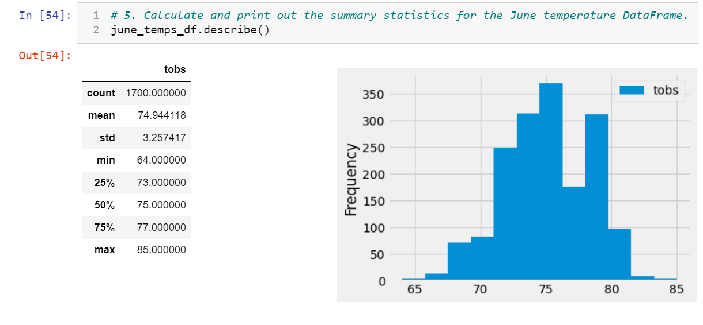
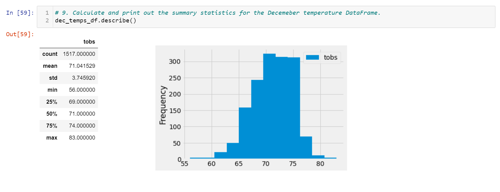

# Weather Analysis using SQLite and Flask

The main objetive of this analysis is to provide insights about wheather temperature trends for market analysis as part of a busines plan to open a new business in Hawaii.

## Results

June and December temperatures seem to behave very close to each other since the mean in June is almost 75 and 71 for December. Also, de standard deviation is 3.25 for June and 3.74 for December, so the minimum temps maintain around 64, 56.

- June Temperatures:

- December Temperatures:

## Summary

To conclude, additional queries could support more the analysis about the weather conditions, such as adding precipitation and other months, also this analysis took data from many years and the weather is changing so taking the last three years could help in the decision to open a business that depends on the cyclicity of the weather conditions.
